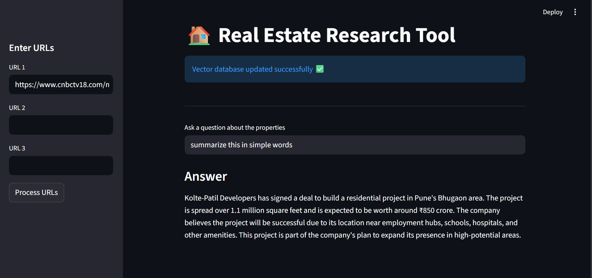

# 🏠 Real Estate Research Tool (RAG)

## 📌 About

This is a Real Estate Research Tool built using **RAG (Retrieval-Augmented Generation)**.

It allows users to:
- Paste real estate article URLs
- Process and store the content in a vector database
- Ask questions in simple English
- Get accurate answers based on the articles

---

## 🖼️ App Screenshot



---

## 🚀 Features

- Accepts multiple URLs
- Extracts content from websites
- Builds vector database
- Semantic search + LLM answering
- Simple Streamlit UI

---

## 🛠️ Tech Stack

- Python
- Streamlit
- LangChain
- Vector Database (FAISS / Chroma)
- LLM (Groq / OpenAI)

---

## ▶️ How to Run

```bash
pip install -r requirements.txt
streamlit run main.py


---

## 📁 Project Structure

.
├── main.py                 # Streamlit app entry point
├── rag.py                  # RAG pipeline logic
├── prompt.py               # Prompt templates
├── requirements.txt        # Python dependencies
├── rag_app_screenshot.png  # App UI screenshot
└── README.md               # Project documentation


---

## 📌 Use Case

This tool is useful for:

- Real estate market research
- News summarization
- Property analysis
- Investment research

---

## 👨‍💻 Author

**Pratik Gaigole**
